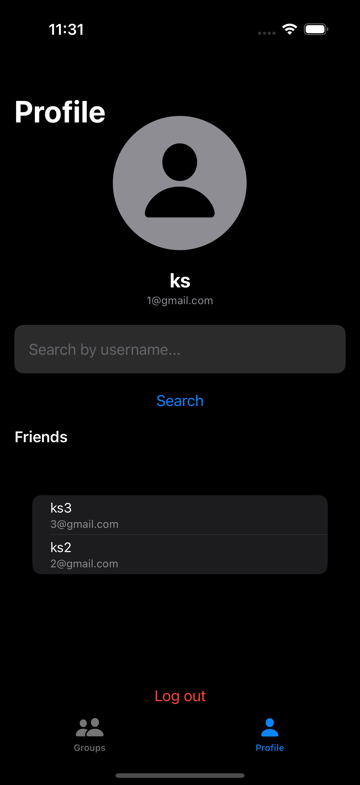
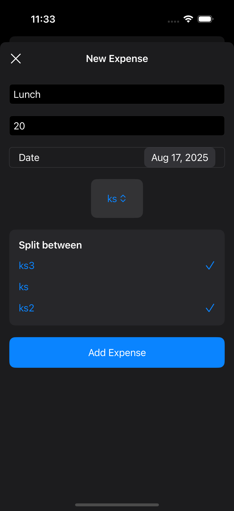
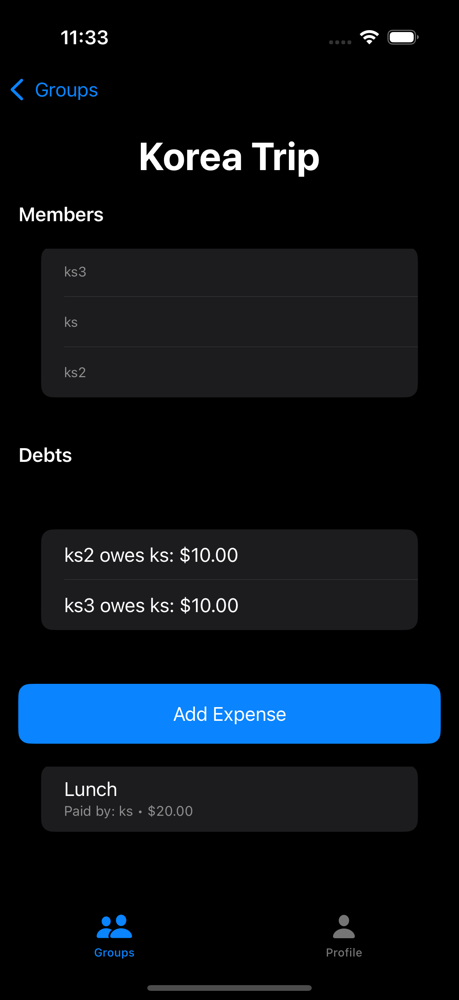

# Splitly

Splitly is a smart expense splitter app for iOS that helps groups evenly split expenses, track debts, and simplify payments. It integrates with Firebase for real-time sync of users, friends, groups, and expenses.

## Features

- **User Accounts**: Sign in with email/password.
- **Friends Management**: Add and remove friends easily.
- **Groups**: Create and delete groups with multiple friends.
- **Expenses**: Add expenses to groups, split evenly among members.
- **Debts Tracking**: View simplified debts across all members and groups.
- **Real-time Sync**: Firebase ensures data is up-to-date across devices.
- **Profile Management**: View your info, friends list, and sign out.

## Screenshots

  
  
  
